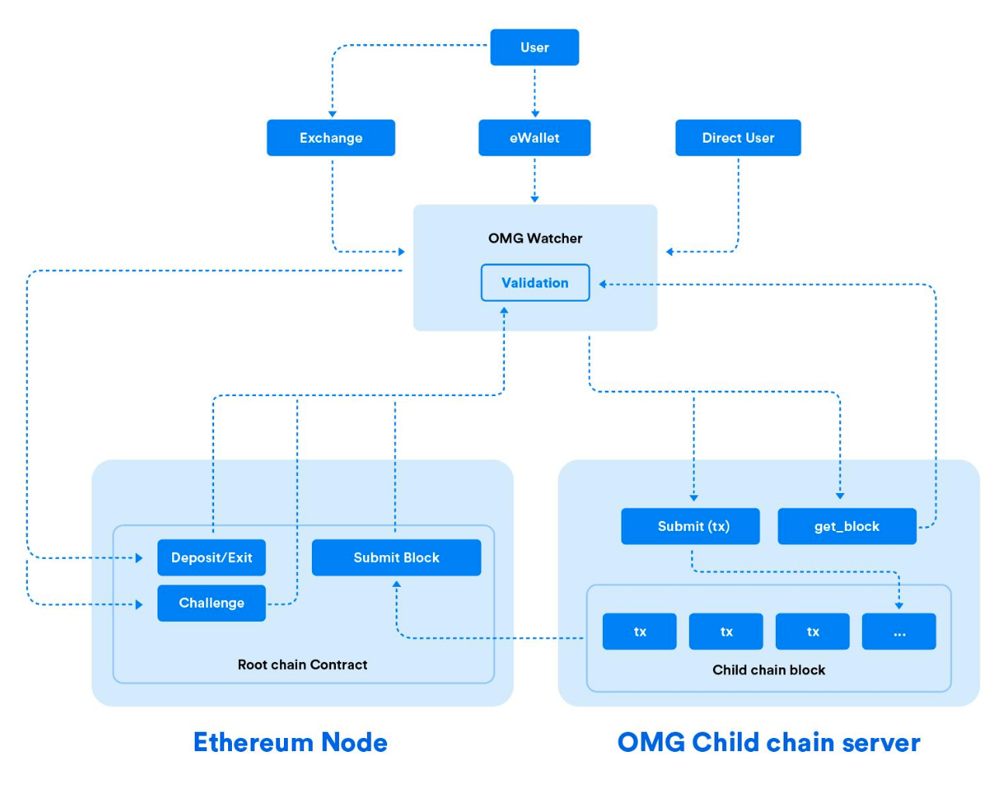

## Overview
This page provides a high level description of the architecture of the `elixir-omg` apps.

The image illustrates the OmiseGO blockchain architecture components, and where the umbrella app fits in. 

> Important! The image is intended as a general, high-level guide only, indicating where the umbrella app fits in with other components.

## Databases

This section describes the two databases that exist.

> Note: It may be confusing that there are two databases. We anticipate that this may change in future.

### `OMG.DB`

This is an *intimate* database for `OMG.State` that holds the UTXO set and blocks.

It may be seen and read by other processes to sync on the persisted state of `OMG.State` and UTXO set by consequence.

Non-relational data, so we're having a simple KV for this.

Each instance of either child chain server or watcher should have its own instance.

Database is required to properly ensure validity and availability of blocks and transactions:

- It is read by `OMG.State` to discover the UTXO set on restart
- It is read by many other processes to discover where they left off, on restart
- It is used for the Watcher's security critical features to access exits info and blocks

### `WatcherDB` 

A database used by the Watcher in convenience API mode **only**. It holds all information necessary to manage the funds held:	

- UTXOs owned by user's particular address(es)
- transaction history

Relational data, to be able to navigate through the transactions and UTXOs.

Implemented with PostgreSQL.
